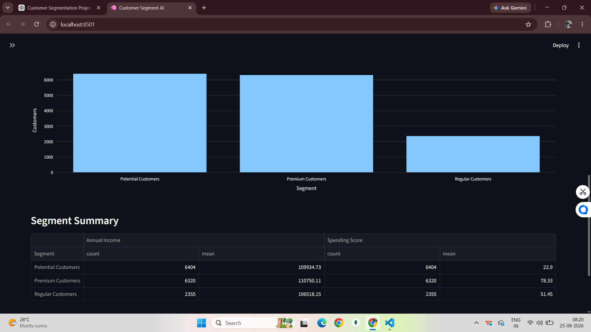
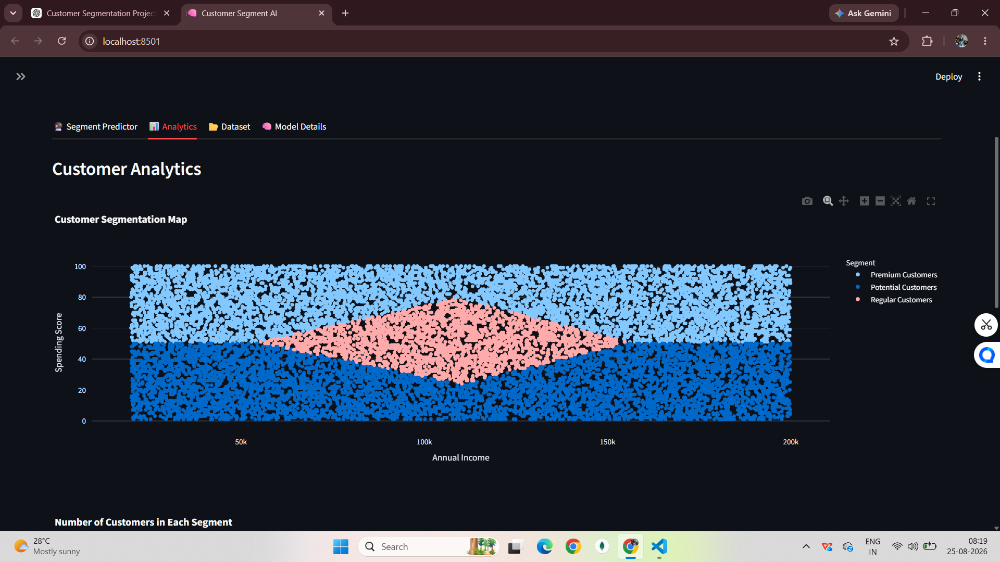
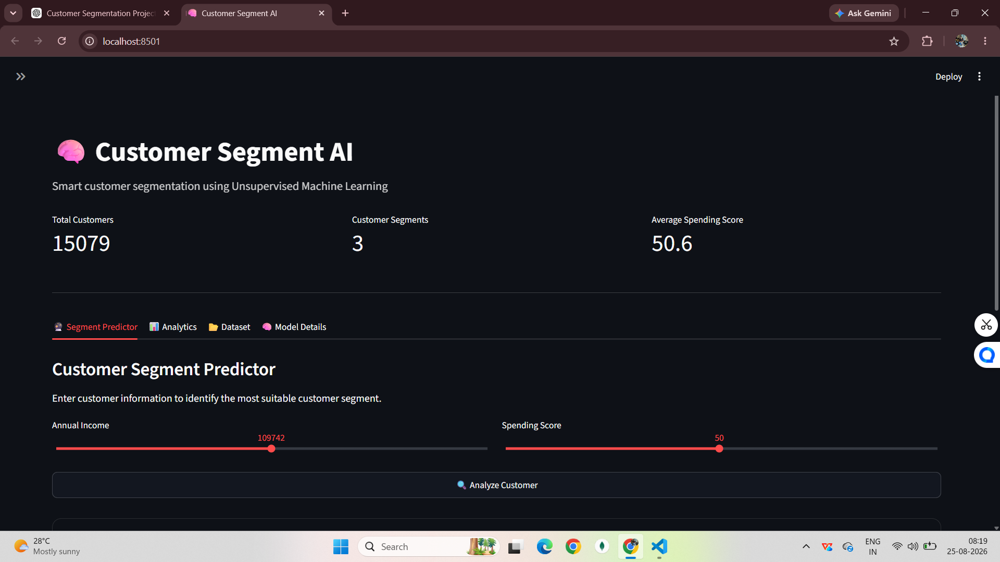

# 🧠 Customer Segment AI

A machine learning application that groups customers using K-Means Clustering and provides business recommendations through an interactive Streamlit dashboard.

## Features

- Unsupervised Learning
- K-Means Clustering
- Customer Segmentation
- Interactive Dashboard
- Business Recommendations

## Tech Stack

Python • Pandas • Scikit-learn • Streamlit • Plotly

## Dataset

Mall Customer Segmentation Dataset (Kaggle)

## Project Workflow

Customer Data
→ Preprocessing
→ StandardScaler
→ K-Means
→ Customer Segments
→ Streamlit Dashboard

## Installation

```bash
pip install -r requirements.txt
streamlit run app.py
```

## Screenshots

## 📸 Application Screenshots

### Customer Segment Predictor



### Customer Analytics Dashboard



### Home



## Author

Mishthi Mahajan & Khushi Singh